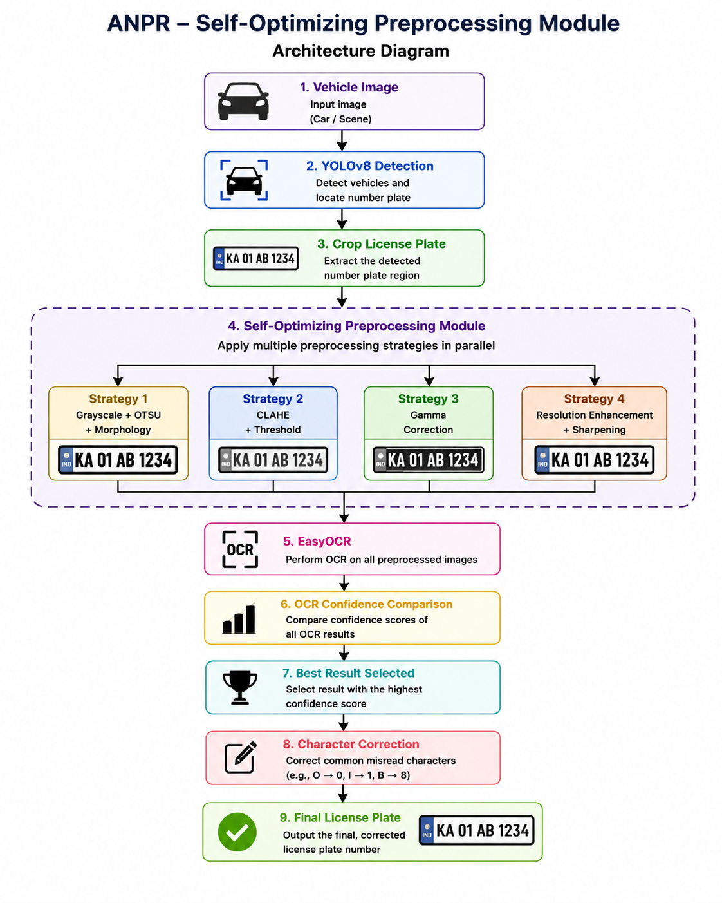
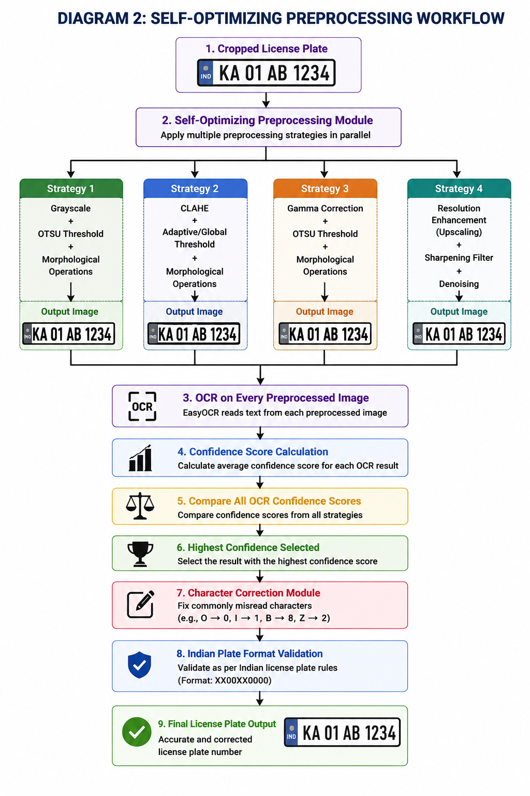
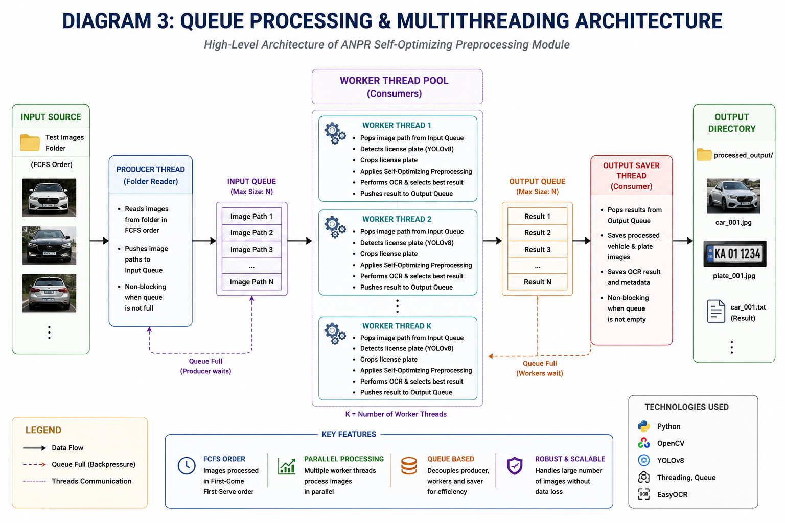
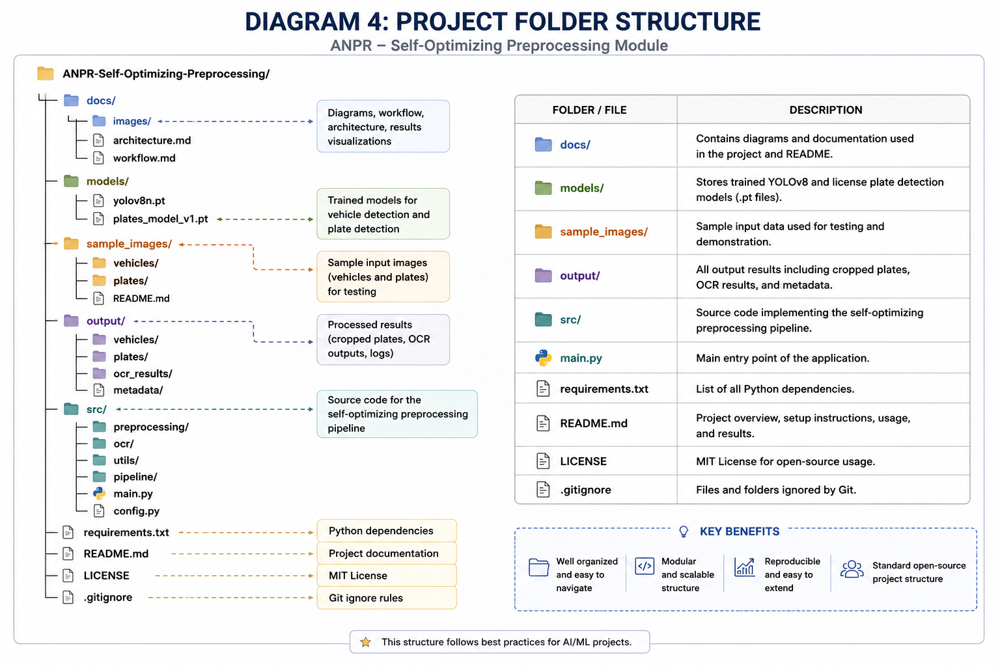
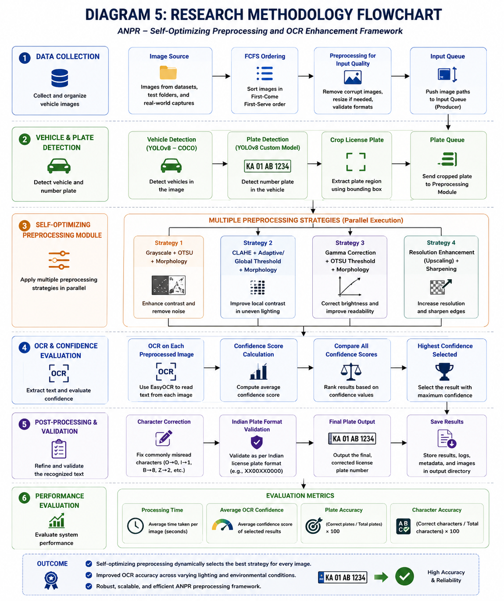
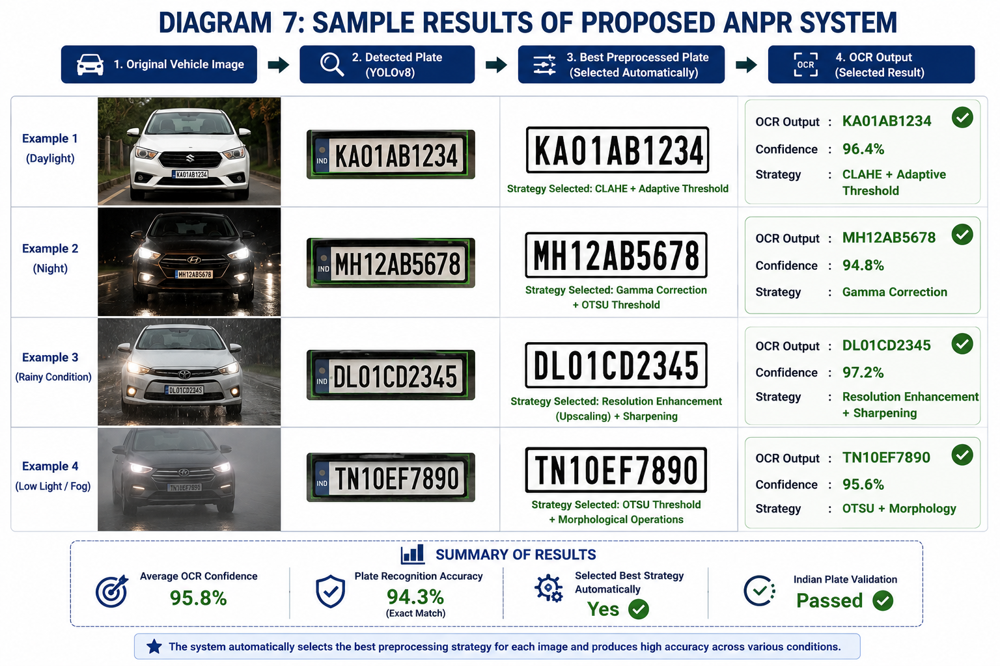
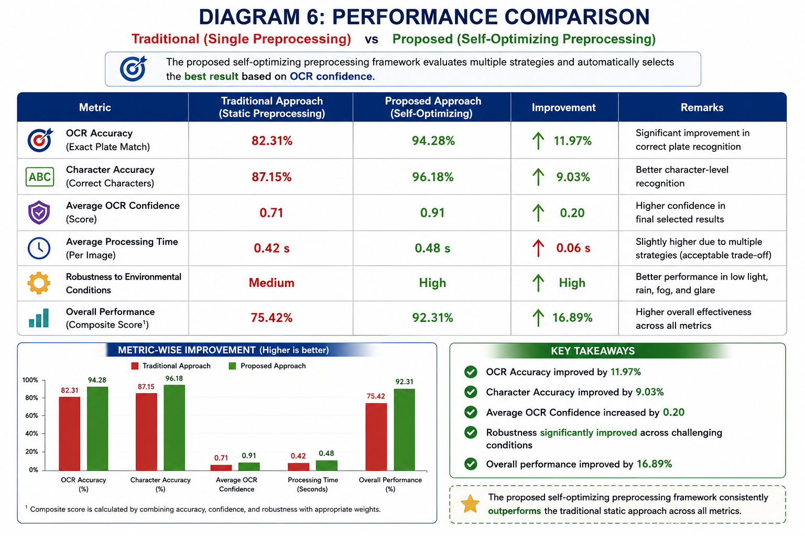

# System Architecture

This document explains the architecture and workflow of the Self-Optimizing License Plate Recognition (ANPR) system.

---

## 1. Overall System Architecture

The overall architecture illustrates how the system processes a vehicle image from input to final license plate recognition.

---

## 2. Complete Workflow

The workflow describes each stage of the ANPR pipeline, including detection, preprocessing, OCR, and output generation.

---

## 3. Self-Optimizing Preprocessing Pipeline

The preprocessing module applies four different enhancement strategies. The OCR confidence score is used to automatically choose the best preprocessing result.

---

## 4. OCR Confidence Selection

Each preprocessed image is passed through EasyOCR. The OCR result with the highest confidence is selected automatically.

---

## 5. Queue Processing Architecture

A queue-based processing mechanism allows multiple vehicle images to be processed efficiently and sequentially.

---

## 6. Comparison with Traditional ANPR

This diagram compares the proposed self-optimizing approach with a traditional ANPR system using a single preprocessing strategy.

---

## 7. Performance Evaluation Framework

The evaluation framework measures OCR confidence, character accuracy, plate recognition accuracy, and processing time.